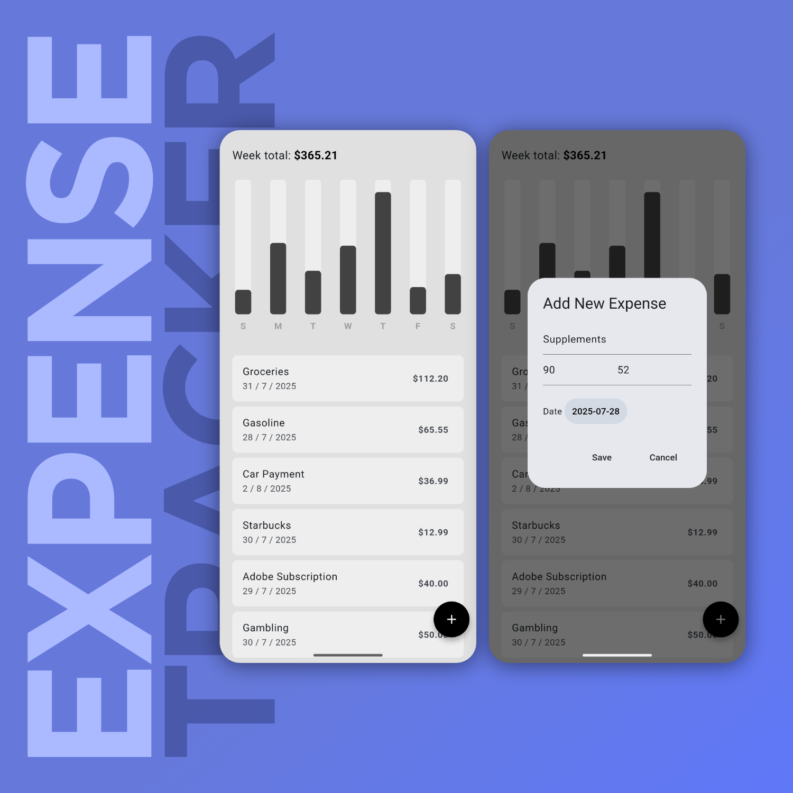

# Minimalist Expense Tracker

This is a simple, minimalist cross-platform expense-tracker mobile app made with Flutter and programmed in Dart.

## 📱About the app

It includes complete create, read, update, and delete functionality for all logged expenses, and cleanly displays the expenses data in an easy-to-read bar weekly overview at the top with a bar graph. The app also saves user data locally on the device using Hive, a lightweight key-value database for Flutter.

## 🚀 Features

- 📝 Add and Edit Expenses
- 📅 View weekly summary in bar-graph
- 💵 Local data storage

## 💻 Screenshot

|  |
| :---------------------------------------------------------------------------: |

## ℹ️ Flutter Guide

A few resources to get you started if this is your first Flutter project:

- [Lab: Write your first Flutter app](https://docs.flutter.dev/get-started/codelab)
- [Cookbook: Useful Flutter samples](https://docs.flutter.dev/cookbook)

For help getting started with Flutter development, view the
[online documentation](https://docs.flutter.dev/), which offers tutorials,
samples, guidance on mobile development, and a full API reference.
